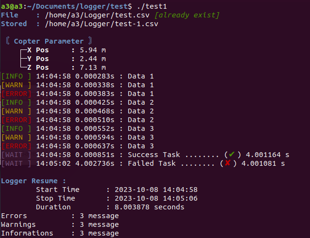

# Logger

Simple C++ Logger Program. It's actually same as ROS_INFO(), ROS_WARN() and ROS_ERROR() in ROS system. But in this project message not just displayed but also write in a file which can be text (\*.txt) or csv (\*.csv).</br>
**ROS Message**</br>
</br>
**Logger Message**</br>

</br>

## Dependencies
**Boost**
```
sudo apt-get install libboost-all-dev
```
## Build
```
git clone https://github.com/Balisa16/Logger.git logger
cd logger
mkdir build && cd build
cmake .. && make -j4
```
If you want to install into your local libraries
```
sudo make install
```

## Testing
**Check**
```
find /usr/local -name libLogger.so
```

Use logger without CMake
```
g++ -o test test.cpp -I/usr/local/include -L/usr/local/lib -Wl,-rpath=/usr/local/lib -lLogger -lboost_system -lboost_filesystem
```
With CMakeList
```
cmake_minimum_required(VERSION 3.10)

project(TestLogger)

set(CMAKE_CXX_STANDARD 11)

find_package(Boost REQUIRED COMPONENTS system filesystem)

include_directories(
    ${CMAKE_CURRENT_SOURCE_DIR}
    /usr/local/include
    ${Boost_INCLUDE_DIRS}
)

link_directories(/usr/local/lib)

add_executable(test1 test.cpp)

target_link_libraries(test1 PRIVATE 
    Logger
    Boost::system
    Boost::filesystem
)

set_target_properties(test1 PROPERTIES 
    INSTALL_RPATH "/usr/local/lib"
    BUILD_WITH_INSTALL_RPATH ON
)
```